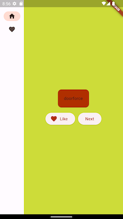
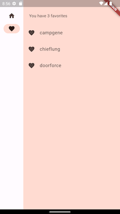

# Flutter Favor

Flutter project

 

## Features

Side menu with buttons. Stretched 
Buttons with icons 
Tracking button clicks 
Changing and forwarding the state between widgets 
Switching between screens 
Transferring data to the second screen 
Localization of strings 
Sound 
Shake Animation 

## Особенности

Боковое меню с кнопками. Растягивается 
Кнопки с иконками 
Отслеживание нажатия на кнопки 
Изменение и проброс состояния между виджетами 
Переход между экранами 
Передача данных на второй экран 
Локализация строк 
Звук 
Анимация 